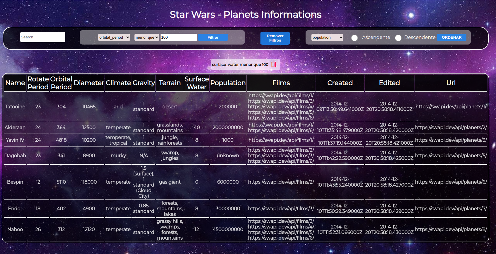

# StarWars - Planet Search

### React | Hofs | ContexAPI | RTL:

  O projeto consiste em consumir uma API com informações dos planetas do Star Wars e criar filtros avançados utilizando high order functions e aplicar os filtros em tempo real, utilizando contextAPI na gerência de estado da aplicação.

## Objetivos:
<section>
- Utilizar a Context API do React para gerenciar estado.
  - Utilizar o React Hook useState
  - Utilizar o React Hook useContext
  - Utilizar o React Hook useEffect
  - Criar React Hooks customizados
  - Escrever testes para garantir que a aplicação possua uma boa cobertura de testes

</section>

 

## Requisitos alcançados:

> 1 - Faça uma requisição para o endpoint /planets da API de Star Wars e preencha uma tabela com os dados retornados, com exceção dos dados da coluna residents
>   2 - Crie um filtro de texto para a tabela
>   3 - Crie um filtro para valores numéricos
>   4 - Implemente múltiplos filtros numéricos
>   5 - Desenvolva testes para atingir 30% de cobertura total da aplicação
>   6 - Não utilize filtros repetidos
>   7 - Apague um filtro de valor numérico ao clicar no ícone X de um dos filtros e apague todas filtragens numéricas simultaneamente ao clicar em outro botão de Remover todas filtragens
>   8 - Desenvolva testes para atingir 60% de cobertura total da aplicação
>   9 - Ordene as colunas de forma ascendente ou descendente
>   10 - Desenvolva testes para atingir 90% de cobertura total da aplicação

 

## Créditos:

- Desenvolvido por mim: Os requisitos e objetivos citados acima e readem.md.

- Desenvolvido pela Trybe: Todo conteúdo, testes, configurações e rtc, exceto o desenvolvido por mim conforme citado acima.
